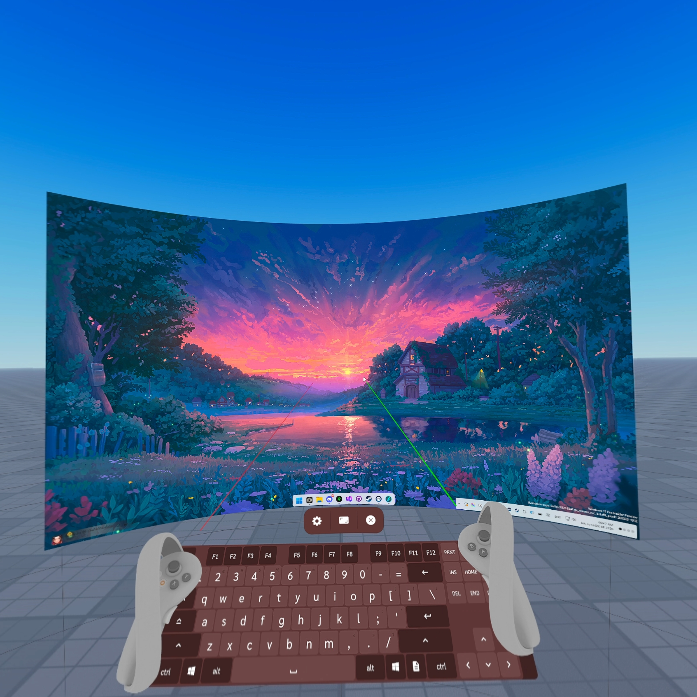
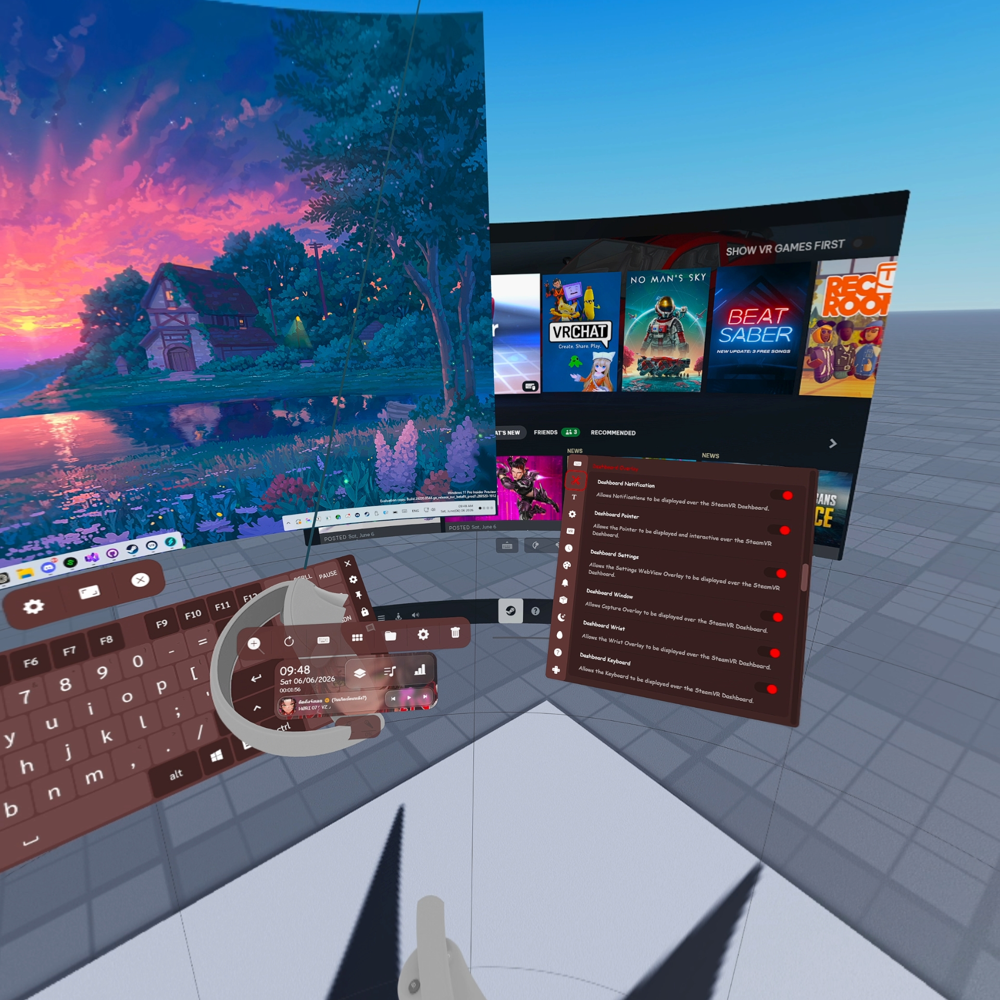
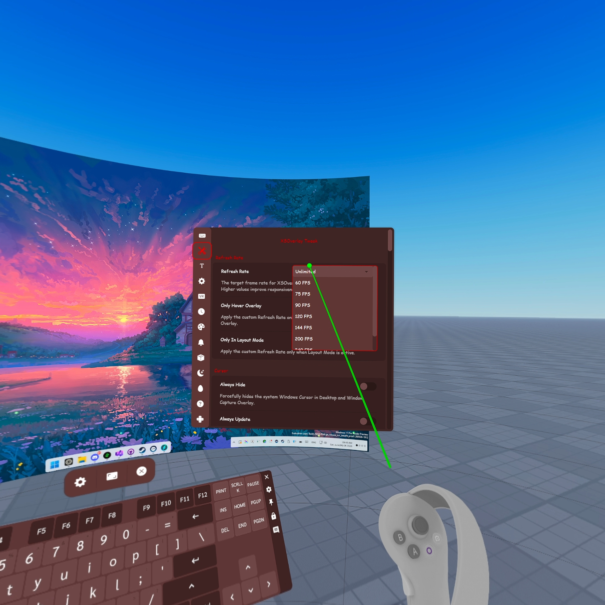

  # XSOverlay Tweak
  ### Quality-of-life [XSOverlay](https://store.steampowered.com/app/1173510/XSOverlay/) improvements, including frame rate override, pointer laser, and issue fixes. 

## 🖥️ Screenshot
  

## Features

### 🚀 Refresh Rate
- **Target Refresh Rate**: The target frame rate for XSOverlay rendering.
- **Contextual Performance**: Optionally apply Target Refresh Rate only when hovering over an overlay or while in Layout Mode.

### 🖱️ Cursor & Mouse
- **Always Hide**: Forcefully hides the system Windows Cursor in Desktop and Window Capture Overlay.
- **Always Update**: Reduces Windows Cursor latency by sending the position from the Pointer before the desktop frame is captured.
- **Mouse Smoothing**: Adjusts the level of smoothing applied to the Windows Cursor within Capture Overlay.
- **Physical Mouse Detector**: Relinquishes Pointer control when physical mouse movement is detected.
- **Windows Cursor Pointer**: Hides the Capture Overlay Cursor and uses the Windows Cursor image as the Pointer to mimic the SteamVR Dashboard.

### 👈 Pointer & Interaction
- **Active Click**: Clicking the inactive hand's Pointer makes it the Active Hand and performs a Mouse Click simultaneously for two-hand interaction.
- **Active WebViews**: Applies the inactive Pointer features to WebView Overlay such as Settings, Wrist, and others.
- **Double Click Delay**: Applies the Double Click Delay from XSOverlay settings to the physical Pointer itself, not just the cursor.
- **Emulate Mouse Click Animation**: Enables the Pointer click visual animation for Input Method > Emulate Mouse.
- **Inactive Highlight**: Highlights the inactive hand's Pointer in red for easier identification.
- **Inactive Opacity**: Sets the opacity level for the inactive hand's Pointer.
- **Scale Multiplier**: Multiplier for the Pointer scale relative to the global XSOverlay setting.

### 🎮 Mouse Navigation
- **Enable**: Custom keybindings for Mouse Forward/Back navigation.
- **Use Alt+Left/Right**: Use Alt+Left/Right keyboard shortcuts for navigation instead of Mouse Clicks. Targets the focused window instead of the hovered window.

### 🖥️ Dashboard Overlay
- **Persistent Visibility**: Allows Overlys to be displayed over the SteamVR Dashboard
  - Notifications, Pointer, Settings, Capture Windows, Wrist, and Keyboard.

### 📳 Haptic Feedback
- **Granular Feedback**: Individual various interactions:
  - Grabbing, Keyboard Hover/Press, Overlay Swapping, WebView interaction, and Pointer Locking.
- **Contextual Vibrations**: Haptic feedback for Sticky Keys and toggle Layout Mode.

### ⚡ Optimization
- **Efficiency Mode**: Enables Windows Efficiency Mode for XSOverlay to reduce CPU usage when not interacting with any Overlay.
- **Inactive Refresh Rate**: The target Refresh Rate for XSOverlay rendering when not interacting with any Overlay.
- **Optimization OSC**: Instead of connecting to OSC in the loop thread, connect to the OSC server when new data is sent.

### ✨ Quality of Life
- **Default Capture Overlay Texture**: Initializes a Capture Overlay with a white texture to prevent new spawns from appearing invisible.
- **Double Click Confirm**: Ensures that a Double Click is always sent reliably when using Emulate Mouse mode.
- **fpsVR Socket**: Attaches the fpsVR overlay to a specific socket position of XSOverlay.
- **Laser**: Draws a Laser Pointer from the VR controllers to mimic the SteamVR Dashboard for accurate targeting.
- **Overlay Curve Auto Refresh**: Automatically applies Overlay Curve changes to all active behaviors. For example, when the Overlay Curve setting changes, Overlay Scaling and Overlay Spawning are affected
- **Pin + Block Input Non Layout Mode**: Blocks interaction with 'Pinned' or 'Block Input' Overlay unless Layout Mode is active.
- **Pull Trigger Click Threshold**: The Trigger pull threshold required to trigger a Left Click.
- **Pull Trigger Pointer Lock**: Locks the Pointer in place while the Trigger is held for easier double clicking.
- **WebView Wider Scroll**: Makes the WebView scrollbar wider for easier interaction.
- **Windows Accent Color**: Using Windows accent color as XSOverlay accent color.
- **Wrist Over Position**: Increases the allowed positioning radius of the Wrist Overlay.

### 🔧 Fixes
- **Ctrl Key Sticky Fix**: Fixes the issue where the Ctrl key is not sticky.
- **Cursor Moving Interaction Fix**: Fix where Windows cursor movement events fail to interact with elements. For example, hovering the cursor over the Windows taskbar displays a thumbnail preview, or dragging to move the system tray icon.
- **Handle Scrolling Fix**: Normalize stick scrolling speed by the HMD refresh rate and support horizontal scrolling.
- **Keyboard Control Button State**: Fix keyboard control button color not following the state when summoning.
- **Load Layout Scale Fix**: Ensures saved scale values are applied correctly when loading an Overlay Layout.
- **Overlay Roll Curve Fix**: Prevents an Overlay from turning invisible when curvature and rotation change simultaneously.
- **WebView Fix**: Fixes an issue where certain WebView UI elements were not clickable.

### ✨ Community Request
- **Hide Battery**: Hide Wrist Overlay battery information widget.
- **Hide Invalid Battery**: Hide invalid battery device from Wrist Overlay.
- **Load Layout Keyboard**: Layout will save the current keyboard state to the selected profile.
- **Mouse Button Swap**: Detect the Windows setting 'Switch primary and secondary buttons' to auto-swap controller binding.
- **Overlay Attach Smooth**: When Capture Overlay is attached to the device, it will add more options to the Window Settings flyout to control Overlay movement behavior, using Position Dampening and Rotation Dampening settings to smooth its movement.
- **Overlay Confirm Close**: Requires pressing the close overlay button three times to close.
- **Window Toolbar Gesture**: When hovering over the Window Toolbar, right-click to switch to the previous Window or use thumbstick scrolling the Window list.
- **Window Toolbar Keyboard**: Add a keyboard  summon button to the Capture Overlay Toolbar.
- **Wrist State Restore**: Restore the last Wrist Overlay state at launch.

## ⛏️ Installation
1. Download the plugin ZIP from [Releases](https://github.com/chaixshot/xxsoverlay-tweak/releases/latest)
2. Extract the ZIP and drop the files and folders inside ``xsoverlay-tweak`` to ``[Steam]/steamapps/common/[XSOverlay]``
3. Launch XSOverlay.
4. Enjoy!

## ⚙️ Configuration

This mod injects a custom settings page directly into the XSOverlay UI.

1. Open the XSOverlay **Settings** menu.
2. Click on the **XSOverlay Tweak** (wrench icon) tab in the sidebar.
3. Adjust settings in real-time.

## 🖱️ Mouse Navigation Setup
To use the Mouse Back/Forward features:
1. Open XSOverlay Settings and go to the **Bindings** tab.
2. This opens the SteamVR bindings menu.
3. Edit your current binding and add a button for the `Mouse Back` and `Mouse Forward` actions.

## ⛔ Disable
Go to ``[Steam]/steamapps/common/[XSOverlay]/BepInEx/plugins/`` and remove ``xsoverlay_tweak.dll``

## 🗑️ Uninstall
Go to ``[Steam]/steamapps/common/[XSOverlay]`` and remove ``BepInEx``, ``doorstop_config.ini``, ``winhttp.dll``

## Credits
- **[XSOverlay](https://store.steampowered.com/app/1173510/XSOverlay/):** The original application by XiS.
- **[BepInEx](https://github.com/bepinex/bepinex):** For the plugin framework.
